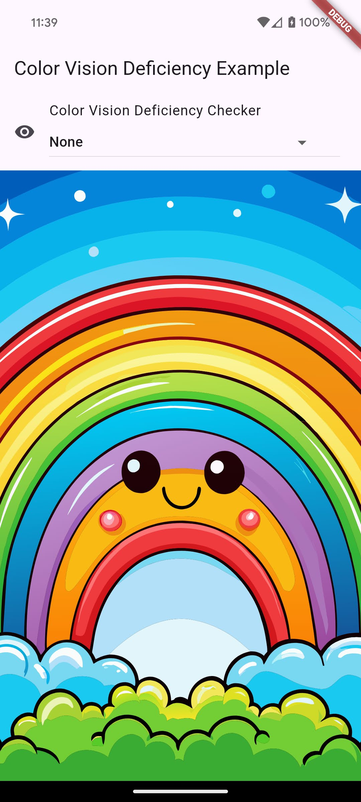
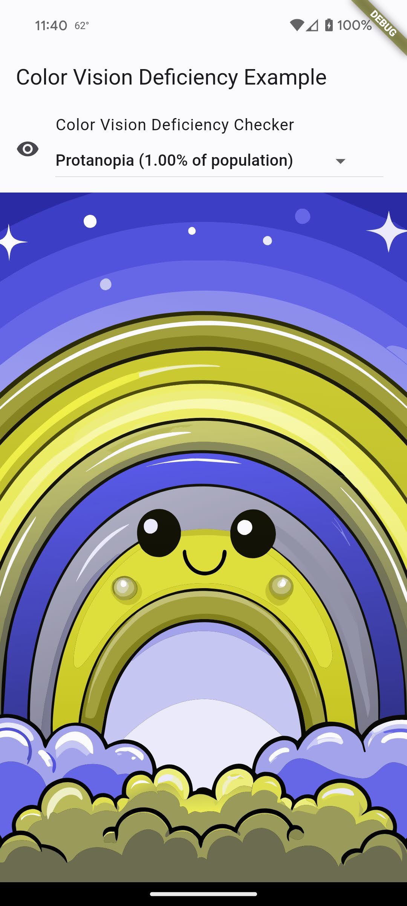
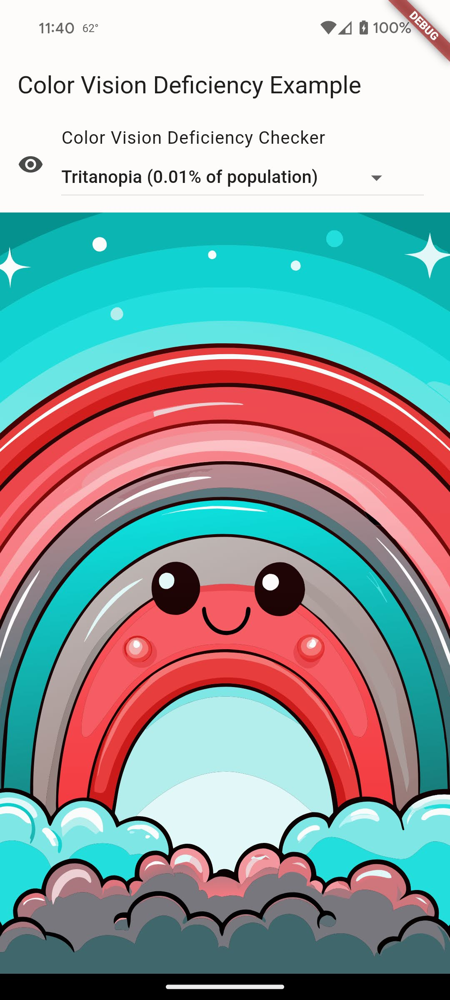

A set of tools to develop better apps for people with Color Vision Deficiency (CVD, aka color blindness). This lets you see how your app appears in the eyes of someone with CVD.





## Getting started

Wrap your `MaterialApp` with `ColorDeficiencyFiltered` to see what it looks like in the eyes of people with CVD. Use `ColorDeficiencyDropdown` to easily switch between different types of CVD.

## Usage

IMPORTANT: To use `ColorDeficiencyDropdown`, you must include the translations
 delegate in your `MaterialApp` constructor:

 ```dart
 import 'package:color_vision_deficiency/l10n/app_localizations.dart' as cvd;

 MaterialApp(
   // ...
   localizationsDelegates: [
    ...AppLocalizations.localizationsDelegates,
    cvd.AppLocalizations.delegate,
   ],
   supportedLocales: S.locales,
 );
 ```